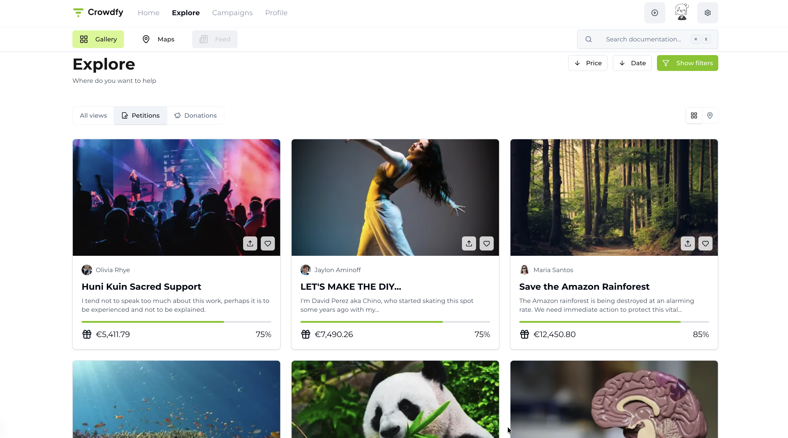
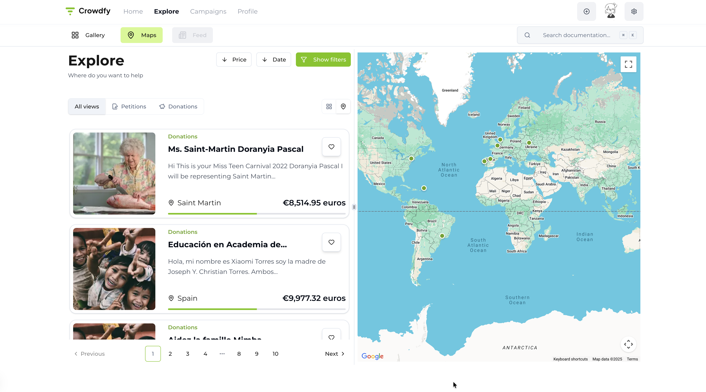
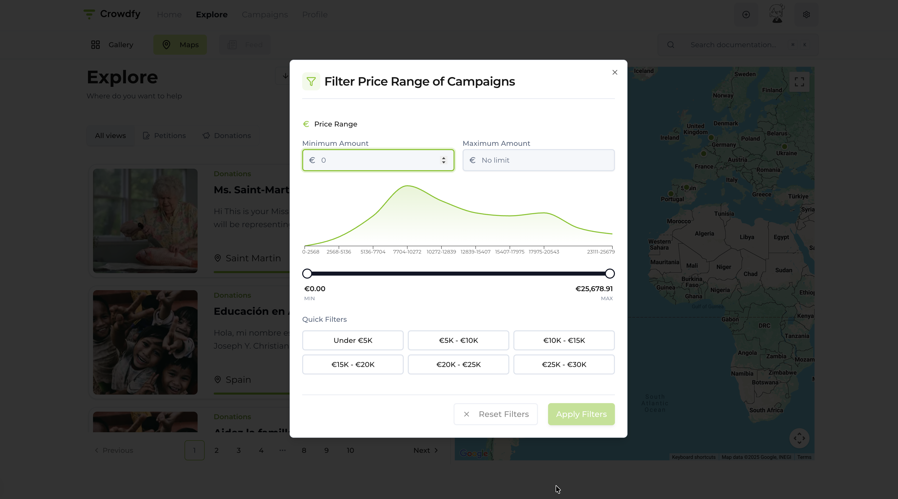

# Crowdfy

A modern crowdfunding platform built with Next.js, React, and TypeScript. Explore campaigns, filter by price range, view on maps, and manage your favorites.

## Product

Add your production screenshots here to showcase the application.

<!-- Add your production screenshots here -->
Campaign Gallery View

Campaign List View

Filter Panel


## Features

- **Campaign Exploration**: Browse campaigns with gallery and list views
- **Interactive Maps**: View campaigns on Google Maps with location markers
- **Advanced Filtering**: Filter campaigns by price range with visual distribution charts
- **Price Range Slider**: Dual-range slider with Recharts visualization
- **Favorites Management**: Save and manage your favorite campaigns
- **Responsive Design**: Fully responsive design for mobile and desktop
- **Modern UI**: Built with Shadcn UI components and Tailwind CSS
- **Performance**: Optimized with React Query for efficient data fetching

## Prerequisites

Before you begin, ensure you have the following installed:

- **Node.js** 18.x or higher
- **npm**, **yarn**, **pnpm**, or **bun** package manager
- **Git** for version control

## Installation

1. **Clone the repository**
   ```bash
   git clone <repository-url>
   cd crowdfy
   ```

2. **Install dependencies**
   ```bash
   npm install
   # or
   yarn install
   # or
   pnpm install
   # or
   bun install
   ```

3. **Set up environment variables** (if needed)
   
   Create a `.env.local` file in the root directory and read file `.env.example`

## Development

1. **Start the development server**
   ```bash
   npm run dev
   # or
   yarn dev
   # or
   pnpm dev
   # or
   bun dev
   ```

2. **Open your browser**
   
   Navigate to [http://localhost:3000](http://localhost:3000) to see the application.

3. **Start editing**
   
   The page auto-updates as you edit files. The app uses the `app` directory structure.

## Available Scripts

- `npm run dev` - Start the development server
- `npm run build` - Build the application for production
- `npm run start` - Start the production server (requires `npm run build` first)
- `npm run lint` - Run ESLint to check code quality

## Project Structure

```
crowdfy/
├── app/                    # Next.js app directory
│   ├── api/                # API routes
│   ├── campaigns/          # Campaign pages
│   ├── explore/            # Explore page
│   ├── profile/            # Profile page
│   └── layout.tsx          # Root layout
├── components/             # React components
│   ├── common/             # Shared components
│   ├── explore/            # Explore-specific components
│   ├── map/                # Map components
│   ├── providers/          # Context providers
│   └── ui/                 # Shadcn UI components
├── hooks/                  # Custom React hooks
├── lib/                    # Utility libraries
├── store/                  # Zustand stores
├── types/                  # TypeScript type definitions
├── utils/                  # Utility functions
├── data/                   # Static data files
└── public/                 # Static assets
```

## Technologies Used

### Core
- **Next.js 16** - React framework with App Router
- **React 19** - UI library
- **TypeScript** - Type safety

### State Management & Data Fetching
- **Zustand** - Lightweight state management
- **React Query (TanStack Query)** - Server state management and caching

### UI & Styling
- **Tailwind CSS 4** - Utility-first CSS framework
- **Shadcn UI** - Re-usable component library
- **Radix UI** - Unstyled, accessible component primitives
- **Lucide React** - Icon library

### Data Visualization
- **Recharts** - Composable charting library

### Maps
- **@vis.gl/react-google-maps** - Google Maps React integration

### Other Libraries
- **Axios** - HTTP client
- **Zod** - Schema validation

## Key Features Implementation

### Filter Panel
- Price distribution chart using Recharts
- Dual-range slider for min/max price selection
- Predefined price range buttons
- Real-time filter validation

### Campaign List
- Gallery and list view modes
- Responsive card layouts
- Infinite scroll pagination
- Search functionality with command dialog

### Maps Integration
- Google Maps integration
- Campaign location markers
- Interactive map controls

## Browser Support

- Chrome (latest)
- Firefox (latest)
- Safari (latest)
- Edge (latest)

## Learn More

- [Next.js Documentation](https://nextjs.org/docs) - Learn about Next.js features and API
- [React Query Documentation](https://tanstack.com/query/latest) - Learn about React Query
- [Tailwind CSS Documentation](https://tailwindcss.com/docs) - Learn about Tailwind CSS
- [Shadcn UI Documentation](https://ui.shadcn.com) - Learn about Shadcn UI components

## Deployment

### Deploy on Vercel

The easiest way to deploy your Next.js app is to use the [Vercel Platform](https://vercel.com/new?utm_medium=default-template&filter=next.js&utm_source=create-next-app&utm_campaign=create-next-app-readme) from the creators of Next.js.

1. Push your code to GitHub
2. Import your repository on Vercel
3. Add environment variables if needed
4. Deploy!

Check out the [Next.js deployment documentation](https://nextjs.org/docs/app/building-your-application/deploying) for more details.

### Other Platforms

You can also deploy to:
- **Netlify** - [Next.js on Netlify](https://docs.netlify.com/integrations/frameworks/next-js/)
- **AWS Amplify** - [Next.js on AWS](https://docs.amplify.aws/guides/hosting/nextjs/q/platform/js/)
- **Railway** - [Deploy Next.js](https://docs.railway.app/getting-started)

## Contributing

Contributions are welcome! Please feel free to submit a Pull Request.

## License

This project is private and proprietary.
